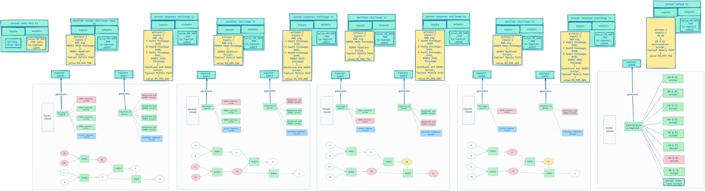

# Background

BitVM’s [white paper](https://bitvm.org/bitvm.pdf) has gained huge attention, and this project can be a promising game changer for Bitcoin ecosystem, there are a lot of community analysis about it.

However, **an overall process article with experimental code** is missing, and the Bitlayer team has decided to fill this gap, enabling more developers to better understand the principles of BitVM.

This article provides a comprehensive overview of the BitVM process, including the construction of challenge trees and response trees, various types of scripts (such as HashLock Script and Prover Timelock Script), and the Equivocation script for penalizing a dishonest Prover. It also covers the complete processes for both honest and malicious Provers. The full BitVM process involves mechanisms such as multi-signature, time locks, and Equivocation detection.

# BitVM Verifying Scheme


In BitVM, to verify the correctness of the above computation, we need to construct three tap trees.

### 1. Challenge Taptree:

The leaves script of this tree show below.


There are mainly two types of scripts. One is the HashLock Script, in which the verifier can reveal the preimage of the corresponding hash to challenge a certain Gate of the prover. The other is a time lock script, which allows the prover to unlock the corresponding UTXO when the verifier has not revealed the preimage of the challenged gate's hash after a certain time (equivalent to the Prover winning the challenge).

- HashLock Script

The `0x737c687538967d2f2d3d5454e19c78ca20962700` can be replaced by other values generated by hash160(preimage).

```jsx
OP_HASH160 
<0x737c687538967d2f2d3d5454e19c78ca20962700>
OP_EQUALVERIFY
```

> `Hash160(0xc00ebfc3) = 0x737c687538967d2f2d3d5454e19c78ca20962700`
> 

If we want to unlock this script we need to provide the preimage for `0x737c687538967d2f2d3d5454e19c78ca20962700` .

- Prover Timelock script

The Prover Timelock script is designed to allow the Prover to withdraw the staked UTXO when the verifier fails to propose a new gate to challenge within the allotted time.

### 2. Response Taptree:

The leaves script of this tree show below.

The Response Taptree mainly consists of two types of scripts, the first one is "HashLock + Logic Gate Commitment" and the second one is "verifier time lock script".


- HashLock + Logic Gate Commitment

The first type of script is as follows:

```jsx
OP_HASH160 
<0x737c687538967d2f2d3d5454e19c78ca20962700>
OP_EQUALVERIFY

OP_IF 
	OP_HASH160 
	<0x7f9f02d28d2414d8517a63cf97ee43abb37103a4> //premiage 0x65
	OP_EQUALVERIFY 
	OP_1 
OP_ELSE 
	OP_HASH160 
	<0xd9c714b68d5955d64fbb99dc8a97abf5dca65d19>  //premiage 0x64
	OP_EQUALVERIFY 
	OP_0 
OP_ENDIF 
OP_TOALTSTACK 
OP_IF 
	OP_HASH160 
	<0xbbb49318f0dfb016194b90cacb362d74f20be730>  //premiage 0x67
	OP_EQUALVERIFY 
	OP_1 
OP_ELSE 
	OP_HASH160 
	<0x9b4a30911c6bcd2921cd153a2956da397b5793a4>  //premiage 0x66
	OP_EQUALVERIFY 
	OP_0 
OP_ENDIF 
OP_TOALTSTACK 
OP_IF 
	OP_HASH160 
	<0xe97675e96a56a4207930165e30651fafcb71be44>  //preimage 0x69
	OP_EQUALVERIFY 
	OP_1 
OP_ELSE 
	OP_HASH160 
	<0x979163654dae791f03040c63397560c83689f3d8>  //preimage 0x68
	OP_EQUALVERIFY 
	OP_0 
OP_ENDIF 
OP_FROMALTSTACK 
OP_BOOLAND 
OP_NOT 
OP_FROMALTSTACK 
OP_EQUALVERIFY 
OP_1
```

You will find that the first three opcodes 

`OP_HASH160 
<0x737c687538967d2f2d3d5454e19c78ca20962700>
OP_EQUALVERIFY`

are the same as the leaf script of challenge tree.

The Hashlock script of a certain gate in the first type of script is exactly the same as the Hashlock script of the corresponding gate in the challenge. The hope is that, through this method, the Prover can obtain the preimage that the verifier provides when unlocking the UTXO of the challenge tree, and then use it as the input to their own script. This achieves the goal of the verifier being able to direct any gate to let the prover prove its correct execution.

The remaining script is a specific implementation of the NAND gate's Logic Gate Commitment (Section 4 of the BitVM paper), which mainly includes three BitCommitments and one OP_NAND.

OP_NAND implements by ‘OP_BOOLAND OP_NOT’

The final OP_1 in the script is because the BTC script requires the stack size to be 1 at the end of execution.

If we want the calculation logic to be A AND B = C and A = 1, B = 0, C = 1, the input we need to provide is as follows:

```
[
	Buffer.from([0x69]),  // A preimage1
	Buffer.from([0x01]),  // OP_IF solution
	Buffer.from([0x6]),  // B preimage0
	Buffer.from([]),      // OP_ELSE solution
	Buffer.from([0x65]),  // E preimage1
	Buffer.from([0x01]),  // OP_IF solution
	Buffer.from([0xc00ebfc3])  // unlock hashlock 
];
```

- Verifier time lock script

The verifier time lock script allows the verifier to unlock the UTXO after waiting for a certain period if the Prover does not respond to the challenge.

### 3. Equivocation Taptree

The Equivocation Taptree consists of an equivocation script and a prover timelock script.


- Equivocation script

The script shown in the third chapter of the Bitvm Paper, Bit Value Commitment, is as follows:


This script allows the Prover to set 0 or 1 by revealing the preimage of <0xf592e757267b7£30732411e78b34472£8b6£46£3> or <Oxb157bee96d62£685539269920385a834c3113d9a>. However, there is a possibility that the Prover could manipulate the calculation result by revealing 0 and 1 at the same time. This situation is called Equivocation in BitVM and is a behavior that needs to be punished.

We need to construct an Equivocation Script to punish the corresponding Equivocation behavior, the script is as follows:

```
OP_HASH160 
<0xf592e757267b7£30732411e78b34472£8b6£46£3>
OP_EQUALVERIFY 
OP_HASH160 
<Oxb157bee96d62£685539269920385a834c3113d9a> 
OP_EQUALVERIFY 
OP_1
```

Through this script, if the Prover reveals the preimage of hash0 and hash1 at the same time, the verifier can use these two values as inputs to the Equivocation Script to unlock this script and take away the UTXO in the corresponding address.

- Prover Timelock Script

This script provides a time window for the verifier to look for equivocation. If none is found, the Prover can normally recover their UTXO.

# Complete Process

## Honest Prover


1. The prover and verifier execute the program again, generate the above gates and wires, and then independently construct their challenge taptree and response taptree.
2. The prover constructs and signs a transaction to send 1BTC from the UTXO to the taproot address corresponding to the challenge taptree and gives it to the verifier. The verifier checks if the transaction amount of 1BTC is correct and if the output address corresponds to the taproot address of the challenge taptree they calculated. If it is, they give their signature. When this transaction gathers the signatures of both parties, it will be broadcast to the blockchain. (All transactions in the whole process, except for those involving timelock and equivocation, require the multi-signature of the Prover and verifier).
3. The verifier reveals the preimage of the NAND 1 Hashlock to unlock the 1BTC UTXO just sent by the Prover and sends it to the response taproot address.
4. The Prover can obtain the preimage of the NAND 1 Hashlock by checking the verifier's transaction to unlock the response taptree, thus knowing that the verifier wants to challenge their NAND 1 gate. At this point, they can provide inputs that satisfy the NAND 1 Hashlock script to ensure that they can successfully unlock the UTXO just sent by the verifier. For example, the prover would reveal A Hash1's preimage A1, B Hash0's preimage B0, and E1 hash's preimage, as this script ensures that the input and output must satisfy the NAND calculation logic.
    
    
    
5. The Prover and Verifier will continue to repeat similar Response and Challenge processes until the Prover shows Equivocation or proves that all its calculations are correct and then takes back the UTXO that they initially pledged. In our current example, after completing the Challenge and Response for all gates, it is necessary to go through another round of Equivocation (the fifth round in the figure below) to ensure that the Prover has not revealed the preimage of HASH0 and HASH1 for any wire (A...H, any one).
6. If the Prover does not show any Equivocation, they can unlock the UTXO under the equivocation taptree address by waiting for a certain time and then using the Prover time lock script.
    
    
    

The complete process is shown in the following diagram:


There are a few things to note about the process above:

1. After each round of challenge and response for a certain Gate by the Prover and Verifier, the next round's Challenge Tree and Response Tree will exclude them, preventing the Prover or Verifier from refusing to submit a new Gate challenge and response by submitting the same HASH Preimage in different rounds.
2. All leaf nodes in the Challenge Taptree and Response Taptree in the process above have a Timelock script to prevent the Prover or Verifier from not responding; the last timelock script in the Equivocation Taptree leaf node is to leave a time window for the verifier to reveal Equivocation, and when this time window is over, the prover can unlock the UTXO and transfer it back to their account.
3. In fact, each Challenge Tree should be combined with the Equivocation Tree, so that the verifier can check whether the prover has engaged in any Equivocation behavior before each round of challenges. If they have, they can directly unlock the UTXO and take away the reward through the Equivocation script, thereby proving that the Prover has not honestly constructed the entire program.
4. All transactions in the entire process, except for those involving timelock and equivocation, require the multi-signature of the Prover and verifier. The reason for needing the multi-signature of the verifier and prover is because we need to ensure that the UTXO unlocked from the challenge taproot address will be sent to the response taproot address, and the UTXO unlocked from the response taproot address will be sent to the challenge taproot address, because we cannot restrict the UTXO to be transferred to a specific address in the BTC Script.
5. Although theoretically, the verifier can challenge the gate in any order, a smart verifier is likely to use a binary method for the challenge.

## Malicious Prover

In the process involving a malicious Prover, we assume that the Prover wishes to alter the value of G1, changing it to G0 as shown in the following diagram:


In the correct execution of the program, the inputs for NAND3 are E=1, F=0, so `G = E NAND F = 1`. However, if the Prover alters the value of G to 0 when calculating NAND4, F NAND G = H still holds because `0 NAND 0 =1`.


At this point, the verifier can actually know the preimage of G Hash0 and Hash1, and can therefore punish the Prover through Equivocation.

The complete process is as follows:

1. The first two rounds are the same as the honest Prover process, but in the third round of challenge to NAND4, the input provided by the Prover will change to [G Hash0 Preimage, F Hash0 Preimage, H Hash1 Preimage], replacing the original [G Hash1 Preimage, F Hash0 Preimage, H Hash1 Preimage]; as shown in the figure below:
2. In the fourth round of challenges, when the verifier challenges NAND3, the Prover still provides [E Hash1 Preimage, F Hash0 Preimage, G Hash1 Preimage]. Once this round of challenges is completed, the verifier can extract [G Hash0 Preimage, G Hash1 Preimage] from the transaction submitted by the Prover, as shown in the figure below:


1. In the fifth round, the verifier can enter the following witness to punish the Prover's Equivocation behavior and thus take away the BTC pledged by the Prover.

```jsx
witness:{
	inputs:[
		G0,G1
	],
	G0 & G1 equivocation script,
	Tapleaf Merkle Path
} 
```


A complete process diagram is shown below:



# Conclusion

In this article we introduce the BitVM verifying scheme, which include 3 types of Taptrees. Then the article describes the whole process of BitVM verifying, covering two circumstances(honest prover and malicious prover).

Strong recommendation for playing with the [code](https://github.com/bitlayer-org/BitVM-Research) we provide, have fun!